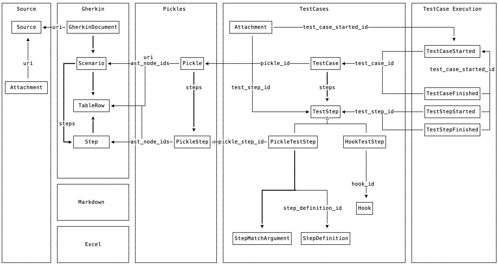

# Cucumber Messages

*Cucumber Messages* is a message protocol for representing results and other information
from Cucumber.

It is currently implemented in the following versions of Cucumber (using the `message` formatter):

* Cucumber-JVM 6.0.0 and greater 
* Cucumber-Ruby 4.0.0 and greater
* Cucumber.js 6.0.5 and greater

## Why Cucumber Messages

Cucumber needs to produce results in a machine-readable format so that other tools can generate reports.
Historically, Cucumber has done this with the `json` and `junit` formatters.

These formats have several shortcomings that are addressed by cucumber messages:

### Lack of streaming

JSON and XML production/consumption is done by serialising/deserialising an object graph. For "big" Cucumber
runs this graph may consume a considerable amount of RAM, in particular if several large attachments
(screenshots) are attached.

This can cause out of memory errors, aborting Cucumber runs or reporting jobs. It also means that no results can be
consumed by downstream processors until the last scenario has finished.

With Cucumber Messages, several messages containing smaller pieces of information are emitted
continuously to a *stream*, avoiding high memory consumption and enabling real-time processing
of results.

### Lack of a schema

The JSON report does not have a formal schema. This has led to slightly inconsistent implementation
of the JSON formatter in various Cucumber implementations. Consumers of the JSON format have
to anticipate and detect these inconsistencies and try to cope with them.

### Limited information

The `junit` XML format can only contain very limited information such as test case name and status.
While there isn't an official schema for JUnit XML, there are a few defacto ones around, and they
are very limited.

The `json` format represents the following information:

* Gherkin source (as a rough and lossy representation of a Gherkin document's abstract syntax tree)
* Attachments (`embeddings`)
* Path and line for step definitions
* Results for hooks

However, it does not contain the following information (but Cucumber Messages does):

* Exact source code
* Exact abstract syntax tree
* Step definitions
* Parameter types

## Protocol Buffers

Cucumber Messages are implemented with [Protocol Buffers](https://developers.google.com/protocol-buffers/).
The messages are defined in [messages.proto](./messages.proto).

Each subdirectory defines language-specific implementations of these messages,
generated from the [messages.proto](./messages.proto) schema.

## Message Overview

The protocol aims to decouple various components of the Cucumber platform so that:

* Each component only needs to know about a subset of messages
* Gherkin is decoupled from the Cucumber execution component
  * This is part of a strategy to support other formats such as Markdown and Excel
  

## Examples

You will find examples of Cucumber Message streams as [NDJSON](http://ndjson.org/) files
in [compatibility-kit](compatibility-kit/javascript/features) directories.

## Utitlities

This library also contains utilities for:

* Reading/Writing message objects as either [varint](https://developers.google.com/protocol-buffers/docs/encoding#varints)-delimited protobuf binary or [NDJSON](http://ndjson.org/).
* Converting timestamps (clock time) and durations (monotonic time) to and from the
  language-specific representation to our own protobuf `Timestamp` and `Duration` messages.

## Detailed message documentation

See the generated [messages.md](messages.md) file.
